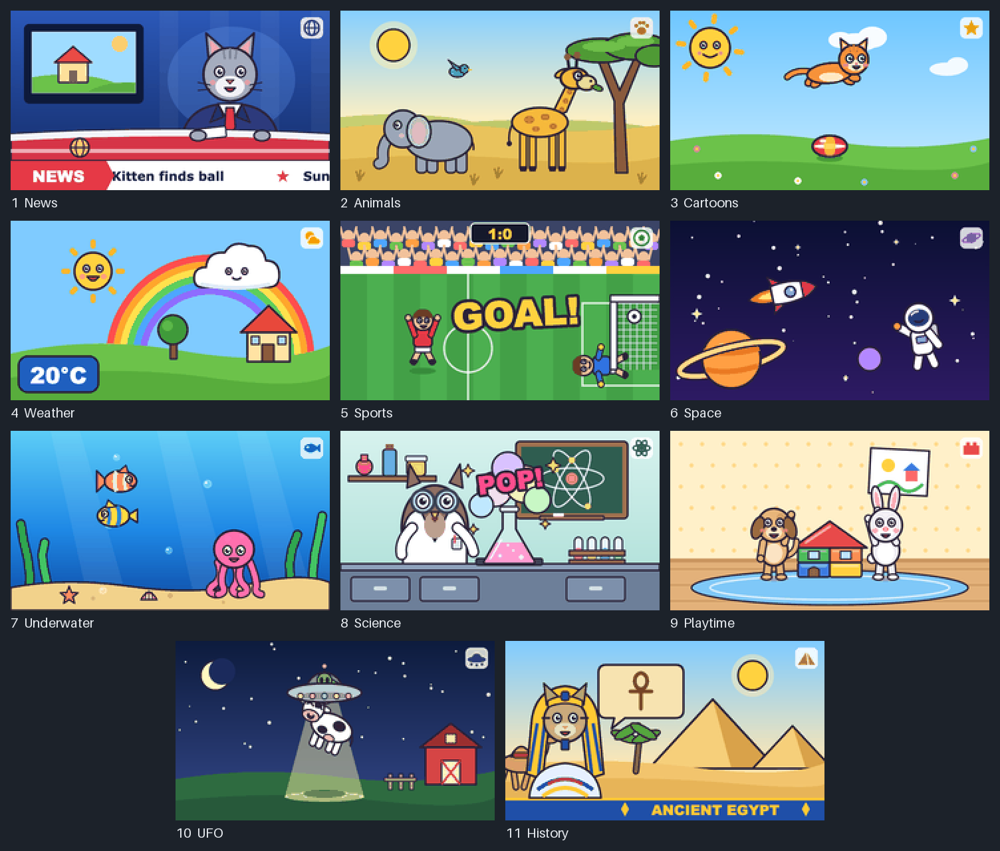

# M5TVset

A toy TV for a LEGO house, running on an
[M5StickS3](https://docs.m5stack.com/en/core/StickS3). It has eleven cartoon
channels, each a looping animation of 6–8 frames. KEY1 changes the channel
with a burst of TV static, KEY2 turns the TV off and on with an old-CRT
effect, and turning the stick over flips the picture. No external hardware
needed.



*One frame from each channel. These are the PNGs from `art/frames/`, the same
images the firmware draws, scaled up 2x.*

## Channels

| # | Channel | What happens |
|---|---|---|
| 1 | News | A cat anchor talks and blinks, the picture on the studio screen changes, a ticker scrolls along the bottom |
| 2 | Animals | A giraffe chews acacia leaves, a baby elephant flaps its ears and trumpets, a bird flies by |
| 3 | Cartoons | A ginger kitten jumps back and forth over a bouncing ball, the sun winks |
| 4 | Weather | A sad rain cloud drifts away, the sun comes out, a rainbow appears, 15 °C becomes 20 °C |
| 5 | Sports | A run-up, a kick, the goalkeeper dives the wrong way, GOAL!, 1:0, the stands cheer |
| 6 | Space | Stars twinkle, a rocket flies past, an astronaut waves, a ringed planet floats nearby |
| 7 | Underwater | Two fish swim across, bubbles rise, seaweed sways, an octopus wiggles its arms |
| 8 | Science | An owl in goggles drops a reagent into a flask: it changes color, foams and goes POP! |
| 9 | Playtime | A puppy and a bunny build a house of toy bricks, cheer, and it wobbles and falls apart |
| 10 | UFO | A flying saucer visits a farm at night, lifts a giggling cow in its beam, puts it back, leaves |
| 11 | History | A pharaoh cat talks about Ancient Egypt while hieroglyphs change in a speech bubble |

All the characters are original.

## Controls

| Control | Action |
|---|---|
| KEY1 | Next channel. After channel 11 comes channel 1 |
| KEY2 | Turn the TV off or on |
| Side button, single press | Power on / reset |
| Side button, double press | Power off |
| Side button, long hold | Download mode (the green LED blinks) |

The side button is handled by the power-management chip, not by the
firmware. When the TV is off, any key turns it back on, on the same channel.

## How it behaves

- **Switching channels:** 0.4 s of static, then the new channel from its first
  frame. The channel number shows in green in the corner for 2 s.
- **Frames:** each frame has its own duration, from 300 to 1300 ms, so a
  moment like GOAL! stays on screen longer.
- **Off and on:** the picture squeezes into a line, then into a dot, and the
  screen and its backlight go off. Turning on plays the same effect in
  reverse.
- **Screen timeout:** the TV turns itself off after 3 minutes without a
  button press.
- **Auto-rotation:** stand the stick on its other long edge and the picture
  flips 180°. A bump, lying flat or standing upright doesn't flip it.

## Building and flashing

You need [PlatformIO](https://platformio.org/).

```bash
pio run -e sticks3              # build the firmware
pio run -e sticks3 -t upload    # flash it
pio test -e native              # run the unit tests on your computer
```

The first build downloads the ESP32-S3 toolchain and takes several minutes.

PlatformIO has no board definition for the StickS3, so `platformio.ini` uses
`esp32-s3-devkitc-1` with octal PSRAM (`qio_opi`) and 8 MB partitions.

If flashing fails with `Failed to connect to ESP32-S3: No serial data
received`, hold the side button until the green LED blinks and flash again.
If the screen stays dark afterwards, press the side button once.

To publish on [M5Burner](https://burner.m5stack.com/), build a single image
with `pio run -e sticks3 -t merged`. The result is
`.pio/build/sticks3/firmware-merged.bin`. M5Burner flashes it from address
0x0, so it contains the bootloader and partition table as well as the app.

## Changing the pictures

The frames are drawn by code. Each `art/scenes/<channel>.py` builds the SVG
of every frame of its channel, and `art/scenes/__init__.py` sets the channel
order. To rebuild the frames after a change:

```bash
python3 art/build.py
```

It needs Python 3 with [Pillow](https://pypi.org/project/Pillow/) and
Google Chrome, which renders the SVGs headless (the path in `art/build.py` is
the macOS one). The script:

1. renders each frame at 4x and scales it down to 240x135;
2. reduces it to a 256-color palette, which makes the PNG about 4 times
   smaller;
3. writes the PNGs to `art/frames/`, generates `src/generated/Frames.cpp` with
   the PNGs and frame durations, and builds `art/preview.html` and its Russian
   version `art/preview.ru.html`.

Open `art/preview.html` in a browser to see every channel in motion and try
the buttons on a simulated TV. The generated `Frames.cpp` is committed, so
building the firmware doesn't need Python or Chrome.

`python3 tools/channel_sheet.py` rebuilds `docs/channels.png` from the
frames.

## How it works

1. `loop()` runs at 50 Hz. It passes the time and the button presses to `Tv`,
   which returns a `Screen`: off, the CRT effect with its progress, static, or
   a channel frame, plus whether to show the channel number.
2. `Renderer` draws that `Screen` into an off-screen sprite and pushes it to
   the display in one go, so it doesn't flicker. It skips the frame when
   nothing changed.
3. A channel frame is a PNG stored in flash. It is decoded into a second
   sprite only when the frame changes, not on every tick.
4. The accelerometer is read on every tick. `Orientation` decides whether
   the stick has been turned over, and the display rotation follows.

The 69 frames take about 540 KB as PNG. The whole firmware is 1.1 MB, a third
of the app partition.

## Project layout

The code is split so that all the logic can be tested on a computer without
the board:

| Path | Contents |
|---|---|
| `lib/Tv/` | The TV: modes, channel switching, channel number, frame timing |
| `lib/Orientation/` | Accelerometer-based 180° flip decision |
| `lib/DisplayTimeout/` | Idle detection for the screen timeout |
| `src/` | Board-specific code: rendering, frame storage, main loop |
| `src/generated/Frames.cpp` | The frame PNGs and durations, generated by `art/build.py` |
| `test/` | Unity unit tests for everything in `lib/` |
| `art/scenes/` | One scene per channel, drawn as SVG |
| `art/build.py` | Renders the scenes into PNG frames, `Frames.cpp` and the preview |
| `art/preview.template.html` | The preview page; `art/preview_ru.py` makes its Russian version |
| `art/frames/` | The rendered frames |
| `tools/merged_image.py` | PlatformIO `merged` target: a single image for M5Burner |
| `tools/channel_sheet.py` | Builds the README image |
| `docs/` | The README image |

`lib/` is plain C++ with no Arduino or M5Unified dependencies. The `native`
environment in `platformio.ini` builds and tests it on the host.

## License

[MIT](LICENSE)
